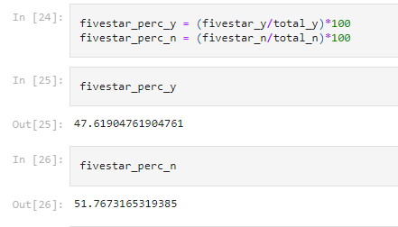

# Amazon Vine Analysis

## Purpose
Performing ETL and analyzing an Amazon luggage reviews dataset(https://s3.amazonaws.com/amazon-reviews-pds/tsv/amazon_reviews_us_Luggage_v1_00.tsv.gz).
This was started by first creating seperate tables using queries in pgAdmin, importing the data into the tables, then sending it to the AWS RDS. I then used pandas to analyze the "vine_table".

## Results

### How many Vine reviews and non-Vine reviews were there?
* There were 21 Vine reviews and 6309 non-Vine reviews.

### How many Vine reviews were 5 stars? How many non-Vine reviews were 5 stars?
* There were 10 5 star Vine reviews and 3266 5 star non-Vine reviews.

### What percentage of Vine reviews were 5 stars? What percentage of non-Vine reviews were 5 stars?
* About 47.62% of Vine reviews were 5 stars and about 51.77% of non-Vine reviews were 5 stars.

## Summary
